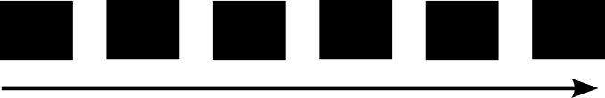

How flows get executed
======================

Flows are implemented using Angular's built-in execution chaining. 
While this simplifies the whole process of running workflows, it does 
introduce some challenges - many of which can be overcome by understanding
a little about how flows are run, and in particular, the way change detection
works. 

|step1|   

The first time a flow is run, each of the blocks is initialised, but 
does not receive any data. This is the "firstRun", and some blocks will have an option to skip execution on this step.

|step2|

Processing then begins a second time,and this time round, the output from 
a block is passed to the next block in the flow. 

|step3|

Many blocks are asynchronous. This means that they will have two different outputs to 
pass on to the block that follows them. The first output will essentially be blank. No actual processing 
has happened yet, as the internal work has been "forked" off. This blank output will pass through the 
flow once, triggering every block to run. 

Once the asynchronous block has completed it's work, it will sent it's output to the next block. This will
then trigger the next processing of the flow. 

|step4|

Every time we hit an async block, processing will split 
again, however, this does not result in any additonal 
processing because the change detection kicks in. 
When a block emits the same output as it did previously, 
Angluar assumes that none of the subsequent blocks
will need to change, and so stops processing the chain. 

|step5|

When building flows, we need to be aware of this change
detection behaviour. If any of our blocks, mapping blocks 
in particular, emit a result that is unchanged from a 
previous run, processing will stop. 

Implications when working with forms
------------------------------------

This is particularly important if a flow contains a form that 
gathers input from the user. When a form is submitted, the 
next block in the flow is triggered and passed the data from
the form. This will then pass on execution to it's child - until 
any block emits the same output as it did before the form 
was submitted. The moment output does not change, 
processing will stop and no more blocks in the flow will run. 

.. |step4| image:: images/execution-blocks-4.png
  :width: 60%

.. |step5| image:: images/execution-blocks-5.png
  :width: 30%

